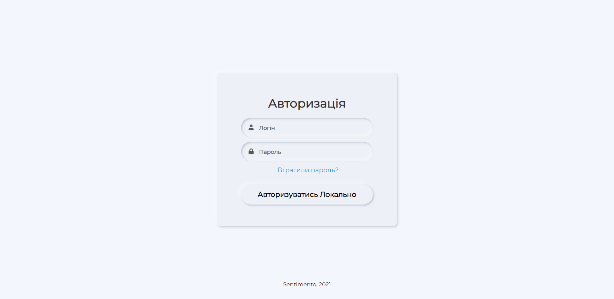
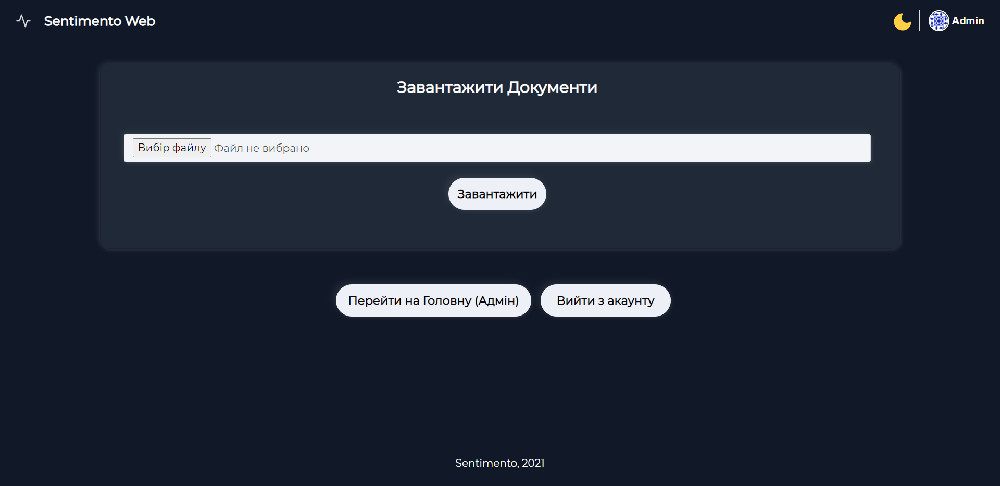
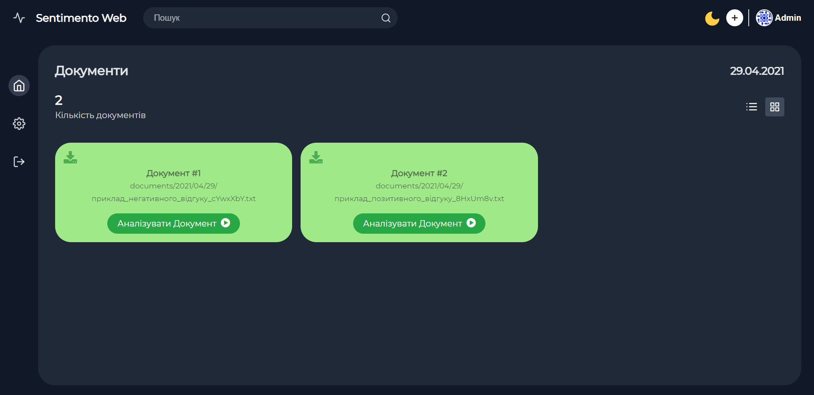
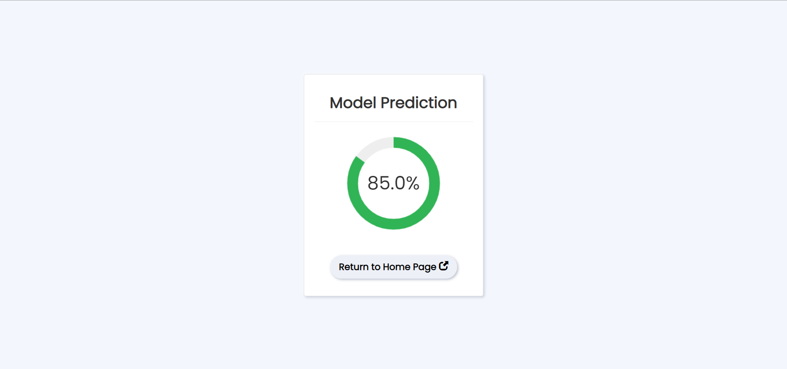

<h1 align="center">Sentimento Web</h1>

<p align="center">
  
</p>

<div align="center"> 
This site was designed for sentiment analysis of text documents on Ukrainian language, ordinary users can simply download documents, and admins, in this case just logged in users, can view all documents and perform selective sentiment analysis. The higher the estimated percentage of the result, the more positive the text.
</div>

## 📝 &nbsp;Requirements

- **Django** (`v3.1+`)
- **Python** (`v3.7+`)
- **Keras** (`v2.4+`)
- **Gensim** (`v3.8+`)
- **Gunicorn** (`v19.6+`)
- **h5py** (`v2.7+`)
- **html5lib** (`v1.0.1+`)
- **NumPy** (`v1.19.5+`)
- **NLTK** (`v3.5+`)
- **python-decouple** (`v3.4+`)
- **pymorphy2-dicts-uk** (`v2.4.1+`)
- **pymorphy2** (`v0.9+`)
- **Tensorflow** (`v2.1+`)


## 📷 &nbsp;App Screenshots

Login Page         |  Upload Page (Light Theme) |  Upload Page (Dark Theme)
:-------------------------:|:-------------------------:|:-------------------------:
 | |

Admin Page (Light Theme)         |  Admin Page (Dark Theme)   |  Predict Page
:-------------------------:|:-------------------------:|:-------------------------:
 | |

## 🚀 &nbsp;How to Run

1. Clone this repository;
2. Make sure that you have all the above requirements;
3. Download [Word2Vec](https://lang.org.ua/static/downloads/models/ubercorpus.lowercased.lemmatized.word2vec.300d.bz2) model (300Mb) with a corpus of word-vectors;
4. Unzip the `bz2` archive (~1Gb), for example using [this](https://www.winzip.com/win/en/bz2-file.html) application);
5. Rename the file to `model-word2vec-300d.txt`;
6. Move the file to the `model/` folder in our application;
7. Enter these commands in the console:

	```console
    >> python manage.py makemigrations
    >> python manage.py migrate
    >> python manage.py createsuperuser
    >> python manage.py runserver
    ```
    
8. Then you will have to wait 5-10 minutes until the server starts and everything is ready!


## 📋 &nbsp;Overview

The models for sentiment analysis that were used in this project were created earlier in [this](https://github.com/JackShen1/sentimento) project, where in 3 parts the whole process of data preparation and training of our model was described, a comparative analysis of classifiers and different models was conducted.


## ✨ &nbsp;Features

|                                         Feature                                         | Implementation |
|:---------------------------------------------------------------------------------------:|:--------------:|
|Conduct sentimental analysis of documents                                            |        ✔️       |
| Ability to upload text files to the server (`.txt`) |        ✔️       |
| Log in to the server              |        ✔️       |
| Fantastic UI                                                                        |        ✔️       |
| Mobile-friendly                      |        ✔️       |
| Ability to add any popular text file formats (`.pdf`, `.doc`, `.odt`)                                                                   |        ❌       |


## 📫 &nbsp;Get in touch

<p align="center">
<a href="https://www.linkedin.com/in/yevhenii-shendrikov-6795291b8/"></a>
<a href="mailto:jackshendrikov@gmail.com"></a>
<a href="https://www.facebook.com/jack.shendrikov"></a>
<a href=""></a>
</p>